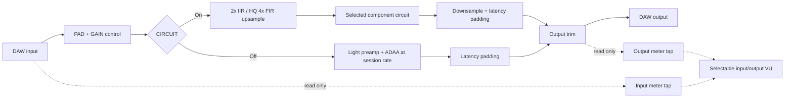
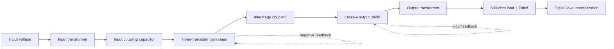

# OpenPreamp circuit — version 0.2.2

This describes the implementation in this checkout. OpenPreamp is a software
simulation: it does not control a physical preamp or supply phantom power.
CIRCUIT on processes at 2x the session rate, or 4x with HQ enabled.
CIRCUIT off processes the lighter models at the session rate with ADAA.

## Plug-in signal path

PAD and GAIN are combined into one smoothed drive setting. They are not two
independent hardware stages in the implementation. Negative drive attenuates
the input. Positive drive changes the selected circuit's gain network;
requests beyond that model's gain limit use additional input trim.
Drive smoothing has an approximately 40 ms time constant.

CIRCUIT on selects the component-network solver. CIRCUIT off retains the
lighter preamp coloration model; it does not switch the preamp to clean bypass.
BYPASS skips the preamp stage while output trim and meters remain active.
Model Off is a clean drive path, so PAD/GAIN can still affect level.
There is no separate EQ or harmonics processor. The preamp's nonlinear devices
naturally generate distortion and harmonics.

Output trim is a digital gain after the simulation. It can reduce the final
level without reducing the drive/distortion that has already occurred.
Meter taps observe the input before preamp processing and output after trim.
They do not process the audio. The VU uses mean-square-derived amplitude and
needle ballistics, calibrated to 0 VU = -18 dBFS. Peak meters show transient
levels; output peak hold and a latching clip lamp indicate peaks near/above
full scale. Clip does not mean a limiter has been applied.

## Default N-Type circuit

These blocks explain the topology. The solver solves the interconnected network
together rather than processing six unrelated effects in sequence.

1. **Input transformer:** the modeled VTB9046 has a 4:1 primary-to-secondary
   ratio. It steps voltage down. Winding resistance, leakage inductance,
   magnetizing inductance and winding capacitance contribute to the response.
   The magnetizing inductance falls as its modeled core saturates, so low-end
   behavior depends on level. It is not a recorded impulse response.
2. **Coupling capacitor:** separates the signal from the amplifier's DC bias.
   Its interaction with surrounding impedances affects bass response and phase.
3. **Three-transistor gain stage:** BC184C-family transistor models amplify
   the signal. A feedback network returns part of the output to control gain.
   The gain control changes its R11 resistor, altering feedback instead of
   merely multiplying the finished output. Junction nonlinearity and headroom
   make the response depend on signal level and gain.
4. **Interstage coupling:** passes the changing audio signal to the driver
   while maintaining the stages' separate operating points.
5. **Class-A output driver:** modeled small-signal transistors drive a 2N3055
   power transistor. Its DC bias establishes an operating point; the transistor
   and output-transformer network provide the loaded output. Supply limits,
   bias and nonlinear device behavior determine overload behavior.
6. **Output transformer and load:** the VTB9049 model has a 1:1.7 ratio and a
   gapped saturating core. The simulated 600-ohm load affects the actual network
   solution. The Zobel is a resistor/capacitor damping network that loads the
   high-frequency response. Estimated core parameters affect low-frequency
   saturation; there is no magnetic hysteresis model.
7. **Normalization:** small-signal gain is measured at 1 kHz during preparation
   and used to normalize the reference output level. It does not remove the
   circuit's frequency response or distortion, and is not automatic loudness
   matching as you turn up drive.

## Other models

| Model | Circuit topology | What the sections do |
|---|---|---|
| Brit | Balanced input/RF filters → matched transistor pair with current feedback → instrumentation pair → difference amplifier → DC servos → balanced driver | Input filtering reduces RF; the balanced stages amplify the difference between the two legs; the gain pot changes two stages together; DC servos control offset; the driver supplies the differential output. |
| A-Type | RF input network → 1:8 input transformer → op-amp with T feedback network → coupling network → 1:2 output transformer → pad/load | Input transformer steps voltage up; pot and switched feedback leg set amplifier gain; coupling separates bias; output transformer and load shape the delivered output. The discrete op-amp and transformer parameters include placeholders. |
| FSF | 1:5 input transformer → attenuator ladder/12-position gain switch → op-amp → coupling → op-amp/class-AB transistor pair → output transformer/load | Hardware gain is stepped; software selects a nearby switch position and supplies trim. The class-AB pair supplies output current. A tertiary transformer winding feeds the output behavior back into the driver loop. Output transformer parameters include placeholders. |

## How the simulation operates

Preparation constructs the network and finds its DC operating point. For each
audio sample, digital amplitude is converted to the model's calibrated input
voltage. The solver enforces current balance at the circuit nodes and solves
for node voltages and inductor/transformer branch currents.

Resistors have a linear voltage/current relationship. Capacitors retain voltage
and current history; inductors retain flux and voltage history. Nonlinear
transistor junctions and saturating inductors make the equations depend on the
unknown solution. The solver uses Newton iterations, starting from the previous
sample, until the network is consistent. Normally it permits up to eight
iterations; a failed step triggers smaller input increments and additional
iterations. The output-node voltage is converted back to digital amplitude.
Stereo has separate circuit state for left and right.

That repeated network solve explains the CPU cost. A higher session rate means
more solves per second. OpenPreamp 0.2.2 uses 2x IIR or HQ 4x FIR resampling for the circuit path,
without decimating the circuit back to a fixed rate. Host latency stays fixed
by padding the shorter paths. The lighter models use first-order ADAA: each
nonlinearity averages its response between consecutive sample values using
an antiderivative (or numerical integration). This reduces aliases at standard
session rates and adds fractional phase/high-frequency rolloff. The full
stateful circuit solver is not changed by ADAA.

The method follows [antiderivative antialiasing for memoryless nonlinearities](https://www.research.ed.ac.uk/files/34115216/bilbao_pdf.pdf).

This is a component-network simulation with estimated parameters and simplified
device models. Brit/FSF use behavioral op-amp models; A-Type's discrete op-amp
is a placeholder. Estimated transformer behavior is not a measured reproduction
of a specific physical unit.

Implementation: Source/OpenPreampPlugin/PluginProcessor.cpp,
Source/DSP/Preamp.h, Source/DSP/CircuitSolver.h and the four *Circuit.h files.
