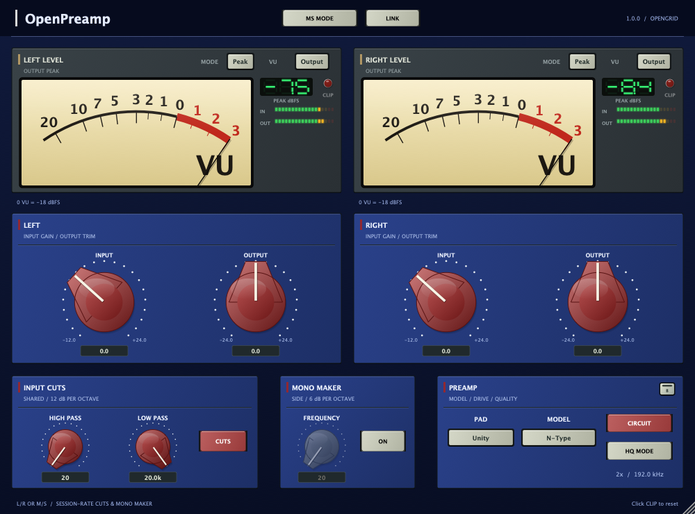
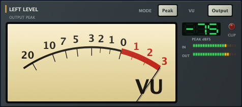
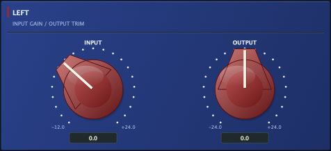
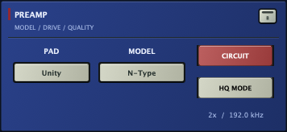
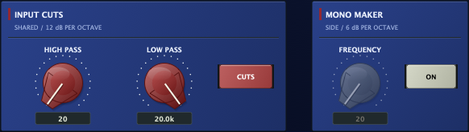
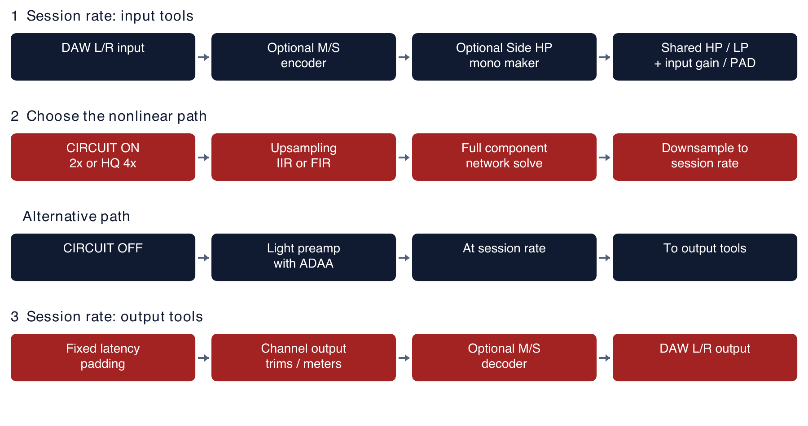
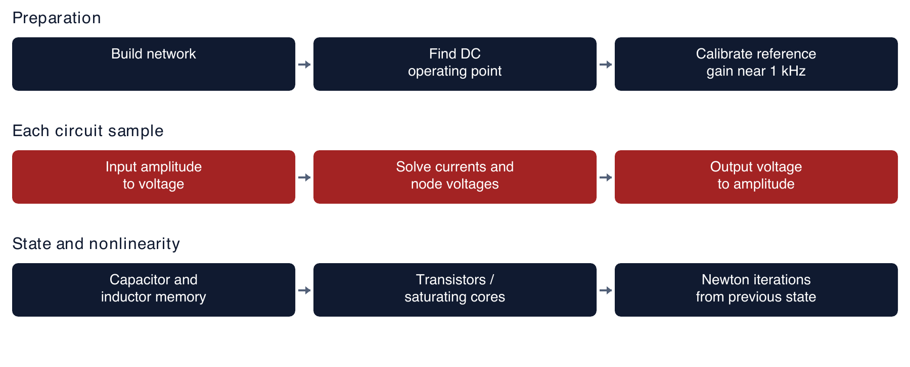
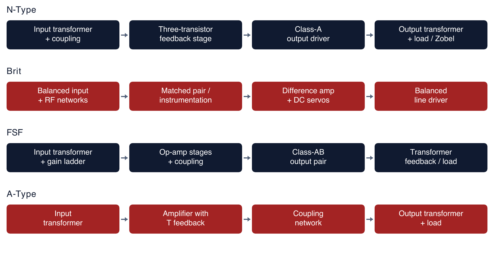

# OpenPreamp 1.0.0

## User manual

**OpenGrid / Marcos Deida**

A preamp, two independent meters, and a stereo or Mid/Side workflow. OpenPreamp combines component-network circuit simulation with a lighter antialiased model. It contains no parametric EQ, spectrum analyzer, separate harmonics engine, automatic loudness matching, or limiter.

**Public Mac formats:** VST3, Audio Unit, CLAP and LV2. Universal Apple Silicon / Intel build, macOS 11 or later. AAX is built privately and is excluded from the public download.

---

## 1. Installation and your first session

Close your DAW before installing. Open the release disk image and copy the whole plug-in bundle for your host into its matching user folder. In Finder, use Go > Go to Folder and paste the path below. Create the final format folder if it does not exist.

| Format | Bundle | User installation folder |
|---|---|---|
| VST3 | OpenPreamp.vst3 | ~/Library/Audio/Plug-Ins/VST3/ |
| Audio Unit | OpenPreamp.component | ~/Library/Audio/Plug-Ins/Components/ |
| CLAP | OpenPreamp.clap | ~/Library/Audio/Plug-Ins/CLAP/ |
| LV2 | OpenPreamp.lv2 | ~/Library/Audio/Plug-Ins/LV2/ |

Restart the DAW and rescan plug-ins. Choose OpenPreamp on a mono or stereo audio track. Copy the complete bundle, not just its executable. Each host supports its own subset of formats; install the format it can load.

Start with INPUT and OUTPUT at 0 dB and PAD at Unity. N-Type is the initial model. CIRCUIT starts on, HQ MODE starts off, and the circuit runs at 2x the session rate. CUTS starts on at 20 Hz high-pass and 20 kHz low-pass. MS MODE, LINK and MONO MAKER start off. Meters initially show Output in Peak mode.

Turn INPUT up to drive the preamp harder. Turn OUTPUT down to compare the changed sound at a similar listening level. There is no automatic compensation between those controls. Double-click an input or output knob to return it to 0 dB.

The window opens at 1000 x 740 and resizes proportionally from 400 x 296 to 1500 x 1110. Drag the lower-right resize handle. Small sizes trade label readability for screen space.

---

## 2. Metering: what each reading means

Each meter belongs to one processing stream. In ordinary stereo the streams are Left and Right. With MS MODE on, they are Mid and Side. Readings remain independent, even when gain controls are linked.

**VU / Input or Output:** click the displayed Input or Output key to toggle both meters together. Input is tapped before the mono maker, cuts and input gain. In M/S it is tapped after encoding. Output is tapped after the preamp, downsampling, latency padding and channel output gain; in M/S this is before decoding to L/R.

**MODE / Peak or RMS:** click Peak or RMS to switch both meters together. Peak drives the needles from the maximum sample amplitude accumulated between UI updates; the numeric display shows peak hold. RMS drives the needles from the square root of mean-square amplitude; the numeric display shows the current RMS level in dBFS. Both needle modes retain the display's mechanical smoothing. Peak mode is not a dedicated standards-calibrated PPM meter.

**Calibration:** 0 VU corresponds to -18 dBFS amplitude. RMS is shown without an added AES-17 +3 dB correction. A sine wave's RMS reading is therefore about 3 dB below its peak reading. These are sample-peak readings, not reconstructed intersample true peaks.

**Small IN / OUT bars:** always show sample peaks for the incoming and outgoing processing stream. They do not switch to RMS. The numeric Peak display holds a maximum for about 1.5 seconds, then falls at 12 dB per second. The small bars fall at 24 dB per second.

**CLIP lamp:** latches when a measured sample reaches approximately full scale. Click the lamp to reset it. It remains peak-based in RMS mode and is an indicator, not a limiter. Changing Input/Output resets the meter's hold, clip lamp and needle; changing Peak/RMS resets the needle position.

---

## 3. Input gain, output trim and Link

| Control | Range or choices | Operation |
|---|---|---|
| INPUT, left | -12 to +24 dB | Drives Left, or Mid in M/S mode. Applied at session rate before upsampling. |
| OUTPUT, left | -24 to +24 dB | Trims Left, or Mid, after downsampling and before M/S decoding. |
| INPUT, right | -12 to +24 dB | Drives Right, or Side in M/S mode. |
| OUTPUT, right | -24 to +24 dB | Trims Right, or Side, after downsampling. |
| LINK | Off / On | In L/R, both right gains follow the left gains and the right knobs are greyed out and disabled. |

Unlinking restores the independent right knob values; linking does not overwrite them. LINK starts off. When MS MODE is on, LINK remains visible but becomes grey and disabled. Its stored setting is ignored until normal L/R returns.

INPUT and PAD are external input trims. They drive a circuit whose internal gain network is held at unity; INPUT is not an adjustable feedback resistor in the circuit solver. Gain changes use 10 ms ramps at the session sample rate. OUTPUT and the M/S matrix also run at session rate.

Separate nonlinear circuit and ADAA histories are maintained for each channel. Linking trims does not share audio or solver state between Left and Right.

---

## 4. Preamp model, PAD, Circuit, HQ and bypass

**MODEL:** opens a menu for Brit, N-Type, FSF, Off and A-Type. The selected model is shared by both streams. Model changes also select the saved faceplate, panel finish, knob style and accent colour.

**PAD:** opens a menu for -20 dB, Unity and +10 dB. It adds the same input offset to both input knobs. It is a digital input trim ahead of the preamp, not a switched attenuator inside the modeled hardware network.

**CIRCUIT:** on selects the full component-network solver and 2x oversampling. Off selects the lighter, session-rate model with antiderivative antialiasing (ADAA). The same INPUT and OUTPUT controls work in both modes, but the two models are different approximations and need not sound identical.

**HQ MODE:** with CIRCUIT on, raises the circuit to 4x oversampling and changes the resampling filters to linear-phase FIR. It uses the same component model; it does not add another preamp or a separate harmonics engine. With CIRCUIT off, model Off, or bypass, HQ has no effect on processing rate and appears inactive.

**Small bypass key at the upper right of PREAMP:** skips the preamp, input gain/PAD, shared cuts and mono maker. Channel output trims and metering remain active. It is therefore a processing bypass, not a guaranteed unity-level comparison if OUTPUT is changed.

**MODEL = Off:** skips coloured preamp processing while retaining input trims/PAD, cuts, mono maker and output trims. This is useful for isolating the surrounding linear processing. Circuit oversampling is then inactive.

**Rate label:** shows the active factor and processing rate, for example 2x / 96.0 kHz in a 48 kHz session. It updates when audio processing runs. The session-rate processors remain at 48 kHz in that example.

---

## 5. Input cuts and mono maker

**HIGH PASS:** adjustable from 20 Hz to 20 kHz. Removes frequencies below its cutoff with a two-pole Butterworth IIR response: approximately -3 dB at cutoff and 12 dB per octave in the stopband. Its initial frequency is 20 Hz.

**LOW PASS:** adjustable from 20 Hz to 20 kHz. Removes frequencies above its cutoff using the same two-pole Butterworth design. Its initial frequency is 20 kHz. Frequencies are clamped below Nyquist at low session rates.

**CUTS:** toggles both filters. They share frequency settings between streams but have separate filter histories. They run at session rate before input gain and before preamp oversampling. In M/S, the shared cuts act separately on Mid and Side. Double-click HIGH PASS for 20 Hz or LOW PASS for 20 kHz.

The active default cuts are not an exact wire bypass at 20 Hz / 20 kHz. They still attenuate and rotate phase around those cutoffs. At 44.1 kHz, the low-pass transition is close to Nyquist and steepens near the top of the available digital band. This is expected filter behavior. A phase plot is not a frequency-magnitude plot; phase rotation is not a bass boost.

**MONO MAKER / ON:** enables a separate, one-pole high-pass only on Side. It starts off. FREQUENCY is adjustable from 20 to 500 Hz, initially 20 Hz; double-click restores 20 Hz. The slope is 6 dB per octave, with approximately -3 dB at cutoff. Mid is not filtered by this function.

Reducing low-frequency Side narrows bass rather than hard-switching everything below the knob value to complete mono. In L/R mode it temporarily encodes M/S, filters Side, and decodes before the cuts/input trims. In M/S mode it filters the already encoded Side. It runs at session rate, before the preamp, with 10 ms cutoff smoothing. Later independent gains or nonlinear processing can alter the final stereo balance; it is not a post-preamp brick-wall monoizer.

---

## 6. Mid/Side processing and signal flow

**MS MODE off:** ordinary L/R processing, the default. **MS MODE on:** INPUT, OUTPUT and meters become Mid and Side; LINK is disabled. The host always receives L/R at the output.

The encoder is energy-preserving: M = (L + R) / sqrt(2), S = (L - R) / sqrt(2). The decoder is its exact inverse: L = (M + S) / sqrt(2), R = (M - S) / sqrt(2). Perfectly identical L/R feeds only Mid; perfectly opposite-polarity L/R feeds only Side. This normalization is not the 0.5-sum convention used by some other tools.

Encoding, mono maker, cuts and input trims occur before upsampling. Decoding occurs after the signal has been downsampled back to session rate, latency-padded and output-trimmed. Changing Side output changes stereo width before decoding. Separate Mid and Side drive settings can produce different saturation in the two streams.

At equal settings, clean processing with cuts and mono maker off reconstructs L/R apart from the reported latency. Nonlinear saturation deliberately changes that signal; a nonlinear M/S path is not equivalent to processing L/R with the same knob positions.

---

## 7. What circuit modeling actually does

Preparation builds the component network and finds its DC operating point. An audio sample becomes a calibrated input voltage. The solver balances current at circuit nodes and solves the interconnected voltages and branch currents together. The output node is converted back to a digital sample.

Resistors describe voltage/current relationships. Capacitors retain voltage and current history. Inductors retain flux and voltage history. Transistor junctions and saturating inductors are nonlinear, so the answer depends on the signal level and previous state. Newton iterations refine the solution from the previous sample. Difficult steps can use smaller input increments and additional iterations.

This is why CIRCUIT costs more CPU than the lighter path: the entire network must be solved repeatedly. At a 48 kHz session it runs at 96 kHz in normal Circuit mode or 192 kHz in HQ. No internal decimation brings it back to a fixed 96 kHz rate.

Small-signal output normalization is calibrated around 1 kHz. It sets a reference gain; it does not flatten the frequency response, erase distortion or automatically match loudness as INPUT increases.

Models include estimated transformer parameters and simplified devices. Brit and FSF use behavioral op-amps; A-Type's discrete op-amp is a placeholder. These are independent circuit simulations, not measured clones of a particular hardware unit, and the transformer model does not include magnetic hysteresis. Product and company names of inspirations do not imply endorsement.

---

## 8. The four component-network models

**N-Type:** an input transformer feeds a coupling capacitor and three-transistor feedback amplifier. Interstage coupling feeds a class-A output driver, a gapped output transformer and a 600-ohm load/Zobel network. The input transformer steps voltage down; the output transformer steps it up. Magnetizing inductance, leakage, winding resistance, coupling capacitors, device bias and load all participate in the same solve. Its internal feedback gain is held at the plugin's unity setting while INPUT drives it externally.

**Brit:** balanced input/RF networks feed a matched transistor pair with op-amp current feedback, an instrumentation pair, a difference amplifier, DC servos and a balanced line driver. The differential topology and its feedback shape the response and nonlinear behavior.

**FSF:** an input transformer feeds an attenuator/gain-switch network and op-amp stages, coupling, a class-AB transistor output pair and an output transformer/load. A transformer feedback winding participates in the output loop. The simulation contains a stepped internal gain network; the OpenPreamp INPUT knob is external drive rather than that hardware switch.

**A-Type:** an input transformer feeds an amplifier with a T feedback network, coupling, an output transformer and load. It models a transformer-coupled mic-preamp topology. Its discrete op-amp placeholder and estimated transformer parameters limit how closely it can represent hardware behavior.

The five MODEL choices include Off; Off is not a fifth circuit. Every active model owns independent state for the two processing streams.

---

## 9. Circuit off, Circuit on and HQ compared

| Setting | Model and rate | Antialiasing and resampling |
|---|---|---|
| CIRCUIT off | Lighter model at session rate | First-order ADAA around its nonlinear stages; no circuit oversampling. |
| CIRCUIT on, HQ off | Full component network at 2x session rate | Maximum-quality polyphase half-band IIR up/down filters. Minimum-latency design with nonlinear phase. |
| CIRCUIT on, HQ on | Same component network at 4x session rate | Two stages of maximum-quality half-band equiripple FIR up/down filters, with linear-phase resampling. |

ADAA averages a nonlinear stage's response over the interval between successive samples, using an antiderivative or numerical integration. That reduces unwanted aliases in the lighter models at ordinary session rates. It adds fractional phase/high-frequency rolloff and does not turn the lighter model into a full component solver. ADAA is not inserted into the full stateful circuit solver.

HQ supplies more samples per second to the same circuit and changes the resampling filter type. It can reduce aliasing and changes numerical/resampling behavior. It is not a new circuit topology, and it cannot make estimated device models more accurate. Four times the session rate means twice as many circuit samples as the normal 2x path; actual CPU depends on the model, level and host.

The first oversampling stage targets -90 dB stopband up / -75 dB down; the second FIR stage targets -80 dB up / -65 dB down. Linear-phase HQ describes these FIR resampling filters, not the entire plugin: cuts, coupling networks, transformers and ADAA can still affect phase.

All paths are padded to a fixed host-reported latency derived from the rounded-up HQ filter delay. Circuit/HQ switching does not change that report while audio runs. Mode changes reset resampling histories and do not have a transition crossfade; they can produce a brief transient. Filters, trims, mono maker and M/S matrices remain outside oversampling.

---

## 10. Working examples

**Gentle colour:** choose a model, leave CIRCUIT on and HQ off, use Unity PAD, and raise INPUT a little. Reduce OUTPUT to compare at a similar level. Switch the meters to Input to inspect incoming level, then Output to inspect the processed level.

**More drive without a louder comparison:** increase INPUT or use +10 dB PAD, then lower OUTPUT. Distortion depends on the signal, model and mode. The clip light cannot tell you how much modeled analogue saturation is occurring inside the circuit.

**Tighter stereo bass:** enable MONO MAKER and slowly raise its frequency from 20 Hz. Listen to bass width and mono compatibility. The Side filter is gentle, not a hard crossover. Use MS MODE if you also want independent Mid/Side drive and output trims.

**Independent stereo drive:** leave MS MODE off and LINK off. Adjust Left and Right independently. Enable LINK when you want common gain control; unlink to recover the previous independent right settings.

**Inspect only the cuts:** choose MODEL Off, keep CUTS on, disable mono maker, and put all gains at 0 dB with Unity PAD. Use a magnitude response plot to assess level and a phase plot to assess phase rotation. Turning CUTS off provides the clean reference apart from latency.

**Compare processing modes:** level-match OUTPUT while comparing Circuit off, Circuit on and HQ. They may differ in sound and bandwidth. Leave headroom in the downstream chain: this plugin has no output limiter.

---

## 11. Track formats, automation and troubleshooting

| Host track layout | Behavior |
|---|---|
| Mono input / mono output | One active preamp stream and left controls. Right controls, Link, MS MODE and mono maker are disabled; the right meter stays idle. |
| Stereo input / stereo output | Independent Left/Right or Mid/Side streams; all stereo tools are available. |
| Mono input / stereo output | Not supported directly. |
| Surround or other multichannel layouts | Not supported; channel layouts such as 5.1 and 7.1 are rejected. |

The host decides the bus format. A mono recording on a stereo track can still reach the plugin as two channels. Mono tracks retain session-rate cuts and gain; Circuit/HQ rate behavior is the same as stereo, using one active stream.

Parameters are saved by the host and can be automated. This includes model, PAD, gains, bypass, Circuit, HQ, meter source/mode, M/S, Link, cuts and mono maker. The meter choices change display behavior only. There is no separate preset browser inside the plugin.

Older pre-0.3 states copy their former stereo gain into the new right gain and leave the newly introduced cuts off. Later states missing Link or mono maker restore those features off. The 1.0 public build has no DEV editor or filesystem autosave; design CSVs are baked into the binary.

**Missing plugin:** confirm your host supports the installed format, copy the whole bundle, restart and rescan. **Grey control:** check mono track format, LINK, MS MODE, bypass, model Off, CUTS or MONO MAKER state. **High CPU:** compare the lighter ADAA path, 2x Circuit and HQ; higher session rates increase circuit work. **No low-bass or top-end bypass:** active 20 Hz / 20 kHz cuts still filter; disable CUTS for the reference.

---

## 12. Source, licenses and release scope

OpenPreamp's project source is MIT licensed; the included LICENSE contains the copyright and permission terms. GoodLookinUI is separately MIT licensed. Third-party code and SDKs retain their own licenses. The MIT project license does not relicense JUCE, Apple SDKs or the optional Avid AAX SDK.

The official binary-use terms are in BINARY_LICENSE.txt. THIRD_PARTY_NOTICES.txt identifies the included components, and the complete third-party license texts and VST usage/trademark notices are in Licenses/third-party. These files accompany the public package and each plugin's own license folder. Keep the notices with redistributed copies and consult the applicable dependency licenses when building a new binary.

The public 1.0.0 Mac package contains VST3, AU, LV2 and CLAP, this manual, release notes and licenses. AAX binaries and the Avid SDK are excluded. AAX builds are private development artifacts; creating an AAX binary is not proof that it can load in Pro Tools without the required Avid/PACE signing.

Source and release downloads: https://github.com/MistaMin/OpenPreamp

More circuit detail: CIRCUIT_EXPLAINED.md in the source repository. ADAA reference: https://www.research.ed.ac.uk/files/34115216/bilbao_pdf.pdf
