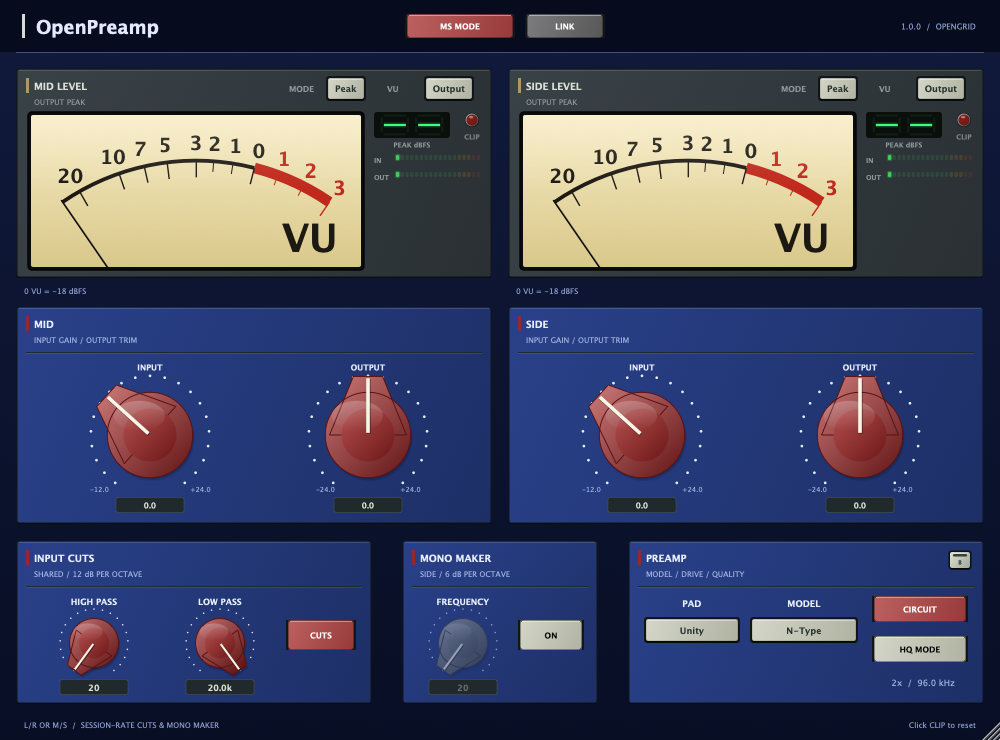

# OpenPreamp

**Circuit colour. Independent meters. Stereo and Mid/Side control.**


OpenPreamp is a preamp and metering tool from **OpenGrid / Marcos Deida**,
extracted from HybridEQ. Four preamp models, two independent processing streams,
and a compact resizable interface - without a parametric EQ or separate
harmonics engine.

[Download 1.0.0](https://github.com/MistaMin/OpenPreamp/releases/tag/v1.0.0) ·
[Illustrated PDF manual](output/pdf/OpenPreamp-User-Manual.pdf) ·
[Online manual](Docs/UserManual.md) · [Version history](CHANGELOG.md)

## Shape the drive, choose the model

- **Brit, N-Type, FSF and A-Type**, plus a clean Off path. Model changes switch
  the saved plates, knob styles and colours.
- **Circuit on:** solve the component network at **2x** session rate using
  minimum-latency IIR resampling. **HQ:** the same circuit at **4x**, using
  linear-phase FIR resampling.
- **Circuit off:** lighter session-rate models with antiderivative antialiasing
  (**ADAA**). HQ does not affect this path.
- Independent **input and output trims**, shared **PAD**, and **Link** for L/R.
- **MS MODE** encodes before the preamp and decodes after downsampling. Link
  greys out while Mid and Side remain independently adjustable.
- Shared **12 dB/octave high/low cuts** and a **6 dB/octave Side-only mono maker**.
  All cuts, gain trims and M/S matrices run at session rate outside oversampling.
- Two independent meters with **Input/Output** and **Peak/RMS** keys that toggle
  directly on click, peak bars, peak hold and resettable clip lamps.
- Proportional resizing from **400 x 296** to **1500 x 1110**; default 1000 x 740.



## Install

The Mac package contains universal **Apple Silicon and Intel** versions of
**VST3, Audio Unit, CLAP and LV2**, for **macOS 11 or later**, plus the illustrated
manual and complete license notices. Close your DAW, copy the entire bundle to
its user folder, restart and rescan.

| Format | User folder |
|---|---|
| VST3 | `~/Library/Audio/Plug-Ins/VST3/` |
| AU | `~/Library/Audio/Plug-Ins/Components/` |
| CLAP | `~/Library/Audio/Plug-Ins/CLAP/` |
| LV2 | `~/Library/Audio/Plug-Ins/LV2/` |

**AAX is excluded from public downloads.** Its optional SDK and private build
are not distributed. Mono and stereo buses are supported; mono-to-stereo and
surround layouts are not.

## How the modeling works

The full circuit path builds component networks, finds their operating points
and repeatedly solves node voltages and branch currents. Capacitors, inductors,
transistors and saturating cores carry state and shape the response. The INPUT
knob drives a fixed-unity internal gain network externally.


HQ changes the sample rate and resampling filters, not the circuit topology.
Its linear phase describes the FIR resampling, not the entire plugin. The
lighter ADAA path is a different approximation. Models use estimated parameters
and simplified devices; they are not measured clones of specific hardware.

See the [user manual](Docs/UserManual.md) and
[circuit explanation](CIRCUIT_EXPLAINED.md) for diagrams, model topologies,
calibration, latency, antialiasing and practical limits.

## Build from source

Project source is **MIT licensed**. Clone with submodules:

```sh
git clone --recurse-submodules https://github.com/MistaMin/OpenPreamp.git
cd OpenPreamp
cmake -S . -B build -DCMAKE_BUILD_TYPE=Release -DOPENPREAMP_DEVELOPER_MODE=OFF
cmake --build build --config Release --target OpenPreamp_VST3 OpenPreampSmoke OpenPreampADAA -j8
./build/OpenPreampSmoke_artefacts/Release/OpenPreampSmoke
./build/OpenPreampADAA_artefacts/Release/OpenPreampADAA
```

On macOS, also build `OpenPreamp_AU`, `OpenPreamp_LV2` and `OpenPreamp_CLAP`.
On Linux, VST3/LV2/CLAP targets are available; the workflow builds downloadable
CI artifacts. The published 1.0.0 package is for Mac. Optional `OpenPreamp_AAX`
builds stay private. Legacy HybridEQ targets remain in the source tree; its
installer and release scripts do not package OpenPreamp.

Developer builds use `-DOPENPREAMP_DEVELOPER_MODE=ON`. **DEV** opens separate
**Knobs / layout** and **Model looks** tabs. Changes apply immediately and
autosave to `Designs/OpenPreampKnobs.csv` and `Designs/OpenPreampLooks.csv`.
Production builds bake those files into the binary and have no DEV tools or
filesystem autosave. See [release process](Docs/RELEASE_PROCESS.md).

## Licensing

[MIT project license](LICENSE) ·
[Official binary-use terms](Licenses/OpenPreamp-BINARY_LICENSE.txt) ·
[Third-party notices](Licenses/OpenPreamp-THIRD_PARTY_NOTICES.txt)

GoodLookinUI is independently MIT licensed. JUCE and format SDKs retain their
own licenses; the MIT source license does not relicense those dependencies.
Complete third-party texts and trademark notices accompany the downloads and
each plugin. Independent builders must comply with the licenses applicable to
their build. Avid SDKs and AAX binaries are never included in the public package.
